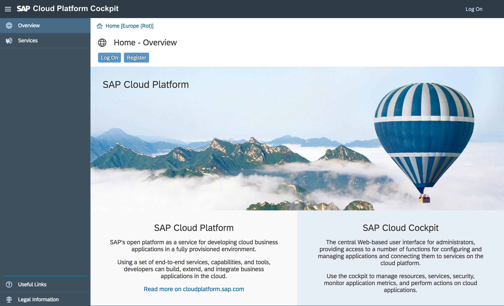
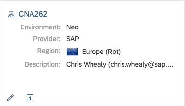
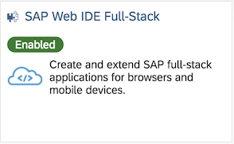
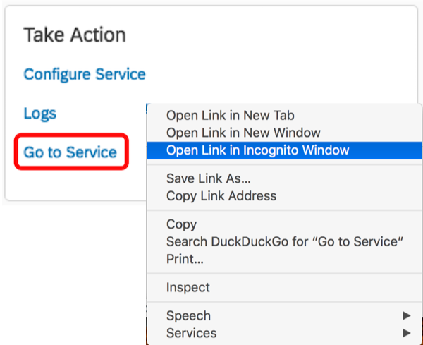

# Prerequisite 1: Log on to SAP Cloud Platform

Here, you will log on to the SAP Cloud Platform in order to obtain the link to your specific instance of SAP Web IDE.

## 1.1: Log on to SAP Cloud Platform

1. Visit the <a href="https://cloudplatform.sap.com" target="_blank">SAP Cloud Platform</a> home page

    

1. Click on "Login ->" in the top right corner and use the credentials supplied by your instructor.

    Please ensure that you are connected to the Productive system <https://account.hana.ondemand.com> ***not*** the Trial system <https://account.hanatrial.ondemand.com>

1. Click on the Subaccounts tile

    

1. Ensure that the Global Account "TechEd2018" has is selected

    

1. Select the CNA262 tile

    

1. From the menu on the left, select "Services" then click on the SAP Web IDE Full-Stack tile

    

1. In the "Take Action" tile, click on the "Go to Service" link

    

   
<a href="#top">Top</a>

# \</prerequisite>
