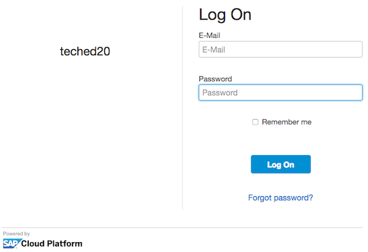
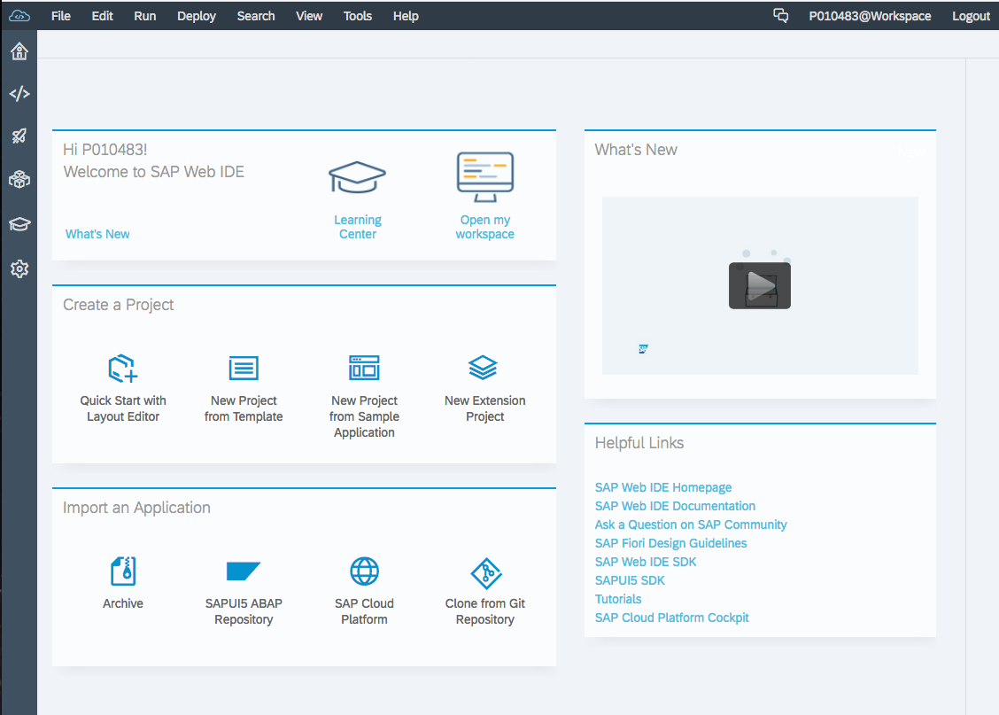

# Prerequisite 2: Log on to Web IDE

1. Use the URL supplied by your instructor to start Web IDE
1. Log on to Web IDE using the credentials supplied by your instructor

    

1. Once logged on, you will see the Web IDE welcome screen

    
   
# \</prerequisite>
