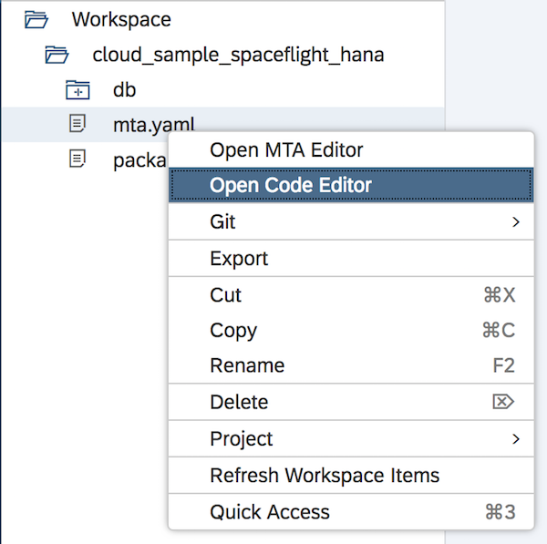

# Prerequisite 2: Create a New Project

You have two options for how to create a new project.  You can either:

* Create the project manually, or you can
* Clone the Git repository containing the exercise template

However, irrespective of how you create the project, you will still need to build and deploy it to your HANA HDI Container in Cloud Foundry.  For both approaches, you will need to select the development perspective in Web IDE.

From the menu down the left side of the screen, select the Web IDE development perspective 


<a name="2.1">

## 2.1: Create the Project by Cloning the Git Repository

1. Right-click on the top-level Workspace item and select Git -> Clone Repository

1. Enter the Git repository name <https://github.com/SAP/cloud-sample-spaceflight-hana.git> and press Clone

1. You should now have a project in your Web IDE workspace called `cloud-sample-spaceflight-hana`

You have now finished this pre-requisite step.


<a name="2.2">

## 2.2: Create the Project Manually

1. Right-click on the top level `Workspace` and select New -> Project From Template

    

1. Select the SAP Cloud Platform Business Application template and press Next

    

1. Enter the name `cloud-sample-spaceflight-hana` and press Next

1. Here we must decide whether to include a Java service and a database.  In our particular case, we are not interested in creating a Java service, but we do want a database (albeit one imported from a different Git repository).

    Select "SAP HANA Database" from the Database dropdown list and press Finish.

    


1. Right-click on the `mta.yaml` file and select "Open Code Editor".

    

1.  Replace the contents of this file with the text below:

    ```yaml
    ID: cloud-sample-spaceflight-hana
    _schema-version: "3.1"
    version: 1.0.0
    
    modules:
     - name: spacetravel-db
       type: hdb
       path: db
       parameters:
         memory: 256M
         disk-quota: 256M
       requires:
         - name: spacetravel-hdi

    resources:
     - name: spacetravel-hdi
       properties:
         hdi-container-name: ${service-name}
       type: com.sap.xs.hdi-container
    ```

    ***Warning***  
    When editing a `.yaml` file, remember that the properties are indentation sensitive.  Removing or changing the indentation shown above can introduce syntax errors!

1. Edit `package.json` and replace the entire file with the following:

    ```json
    {
      "name": "spaceflight-model-hana"
    , "version": "0.1.0"
    , "dependencies": {
        "@sap/cds": "2.x"
      , "spaceflight-model": "https://github.com/SAP/cloud-sample-spaceflight"
      }
    , "scripts": {
        "build": "cds build --clean && reuseTableData"
      }
    , "cds": {
        "data": {
          "model": "db/"
        }
      }
    , "license": "ISC"
    }
    ```

    Notice that an NPM dependency called `spaceflight-model` has been added.  This is how we can reference a CDS data model held in a separate Git repository.

    For a full explanation of what these instructions do, please read [How to Consume a CDS Data Model from a Different Git Repository](./consumeRemoteDataModel.md)

1. Finally, edit `db/data-model.cds`.

    Replace the entire file contents with this single line:

    ```using teched.flight.trip from 'spaceflight-model/db';```
    
    At this point however, the syntax checker will inform you that this file contains a syntax error.
    
    This is a false error message and you don't have to worry about it!
    
    
    
    The error comes from the fact that the syntax checker has assumed the reference to `spaceflight-model` refers to some local CDS file in the current project, when in fact, it refers to the name of the NPM dependency we added into the `package.json` file above.  This name will not exist until ***after*** we have run the CDS Compiler.

    Save your changes to the `data-model.cds` file.

1. By default, SAP Web IDE will run the CDS compiler each time you save a `.cds` file.

    If you wish, you can switch this behaviour off by selecting the preference icon down the left side , then under Global Preferences, select "Core Data Services" and switch off the check box.
    
    

    If you change this setting, don't forget to press "Save" at the bottom of the screen!

# \</prerequisite>
