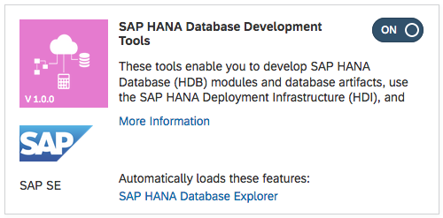
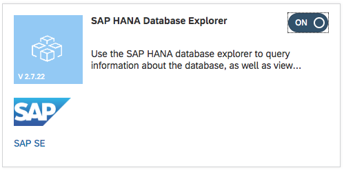
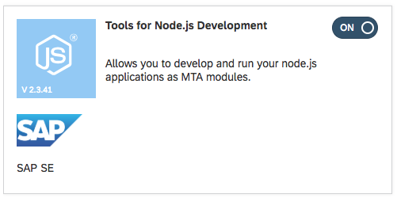

# Prerequisite 3: Configure Web IDE

Once you have logged on to Web IDE, select the preferences icon 

## 3.1: Configure Web IDE's Connection to Cloud Foundry

1. From the "Workspace Preferences", select "Cloud Foundry"
1. Select the name of your Cloud Foundry API endpoint from the drop-down list
1. Select the Organization and Space names from the drop down lists
1. Press the "Save" button at the bottom of the screen

    ***IMPORTANT***  
    Please ***do not*** press the button saying "Reinstall Builder"!  
    Firstly, this action should not be necessary, and secondly, with multiple users sharing the same Cloud Foundry Space, this action need only be performed once per ***Cloud Foundry Space***, not once per ***user***.

## 3.2: Configure Web IDE Features

1. From the "Workspace Preferences", select "Features"
1. Ensure that all of the following features have been switched on.  

      
      
      
      

    After switching all these features on, you ***must*** press the "Save" button located at the bottom of the screen.  

    You must then restart Web IDE in order to activate these new features.
   
# \</prerequisite>
