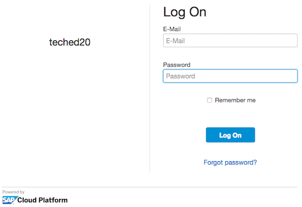
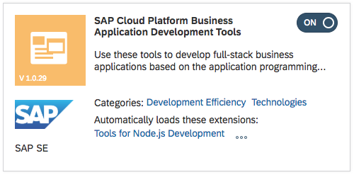
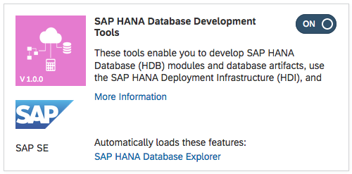
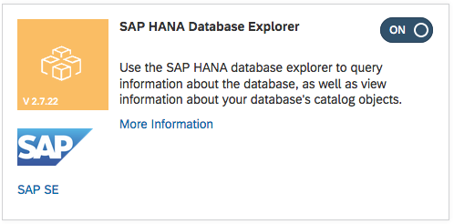
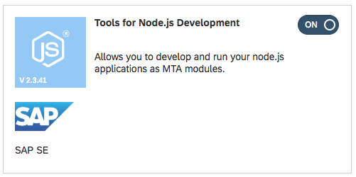
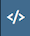

# Exercise 0: Prerequisite Steps


## 0.1 Log On To Your SAP Cloud Platform Account

The instructor will provide you with the following details in order to complete these exercises:

1. The userid and password for the SAP Cloud Platform account
1. The URL to start the correct instance of Full Stack Web IDE

### IMPORTANT

If you already have a trial account on the SAP Cloud Platform, then please ***do not*** use it!  
You will run into memory allocation problems!

## 0.2 Log on to Web IDE

1. Use the URL supplied by your instructor to start Web IDE
1. Log on to Web IDE using the credentials supplied by your instructor

    

## 0.3 Configure Web IDE

1. Once you have logged on to Web IDE, select the preferences icon 
1. From the "Workspace Preferences", select "Cloud Foundry"
1. Select the name of your Cloud Foundry API endpoint from the drop-down list
1. Select the Organization and Space names from the drop down lists
1. Press the "Save" button at the bottom of the screen

    ***IMPORTANT***  
    Please ***do not*** press the button saying "Reinstall Builder"!  
    Firstly, this action should not be necessary, and secondly, with multiple users sharing the same Cloud Foundry Space, this action need only be performed once per ***Cloud Foundry Space***, not once per ***user***.

1. From the "Workspace Preferences", select "Features"
1. Ensure that all of the following features have been switched on.  

    After switching all these features on, you ***must*** press the "Save" button located at the bottom of the screen.  
    You must then restart Web IDE in order to activate these new features.
      
      
      
      

## 0.4 Clone the Git Repository

1. From the menu down the left side of the screen, select the Web IDE development view 
1. Right-click on the top level `Workspace` and select Git -> Clone Repository
1. Enter the Git repository name <https://github.com/SAP/cloud-sample-spaceflight-hana.git> and press Clone
1. You should now have a project in your Web IDE workspace called `cloud-sample-spaceflight-hana`

## 0.5 Compile and Deploy the Data Model to HANA

The data model used by this project is imported from a different Git repository <https://github.com/SAP/cloud-sample-spaceflight-hana.git>.

This data model needs first to be compiled, then deployed to HANA.  So we must perform two steps here:

1. Compile all the `.cds` files in the `db` directory and produce a set of HANA specific `.hdbcds` files in the `db/src/gen` folder
1. Deploy the compiled database definition to HANA.  This step contains additional information to populate the database tables

Currently, the CDS compiler can only create files suitable for the HANA database.  Compiling `.cds` files for other target databases is planned for the future.

### 0.5.1 Compile the Data Model

1. Right click on the `cloud-sample-spaceflight-hana` project name and select Build -> Build CDS.  
    For more information on the behaviour of the CDS compiler, please read this [brief overview](./cdsCompile.md)
    
1. In the bottom right-hand corner of the Web IDE screen is a vertical menu.  

    Click on the console  icon to display the console output of the CDS build tool.  

    As the build tool runs, you will see output similar to the following:

    ```plain_text
    10:55:20 (DIBuild) Build of "/cloud-samples-spaceflight-hana" in progress.  
    10:55:21 (DIBuild) [INFO] Injecting source code into builder...  
    [INFO] Source code injection finished[INFO] ------------------------------------------------------------------------
    npm install
    
    10:55:23 (DIBuild) up to date in 0.871s
    npm run build
    
    > spaceflight-model@0.1.0 build /home/vcap/app/.java-buildpack/tomcat/temp/builder/sap.cds.mta/builds/build-6976017343015870064/cloud-samples-spaceflight-hana
    > cds build --clean
    
    This is CDS 2.7.0, Compiler 1.0.32, Home: node_modules/@sap/cds
    
    10:55:25 (DIBuild) Compiled 'db/index.cds' to
      db/src/gen/.hdinamespace
      db/src/gen/BOOKINGSERVICE_AIRCRAFTCODES.hdbcds
      db/src/gen/BOOKINGSERVICE_AIRLINES.hdbcds
      db/src/gen/BOOKINGSERVICE_AIRPORTS.hdbcds
      db/src/gen/BOOKINGSERVICE_BOOKINGS.hdbcds
      db/src/gen/BOOKINGSERVICE_EARTHROUTES.hdbcds
      db/src/gen/BOOKINGSERVICE_ITINERARIES.hdbcds
      db/src/gen/BOOKINGSERVICE_PLANETS.hdbcds
      db/src/gen/BOOKINGSERVICE_SPACELINES.hdbcds
      db/src/gen/BOOKINGSERVICE_SPACEPORTS.hdbcds
      db/src/gen/BOOKINGSERVICE_SPACEROUTES.hdbcds
      db/src/gen/TECHED_FLIGHT_TRIP_AIRCRAFTCODES.hdbcds
      db/src/gen/TECHED_FLIGHT_TRIP_AIRLINES.hdbcds
      db/src/gen/TECHED_FLIGHT_TRIP_AIRPORTS.hdbcds
      db/src/gen/TECHED_FLIGHT_TRIP_BOOKINGS.hdbcds
      db/src/gen/TECHED_FLIGHT_TRIP_EARTHROUTES.hdbcds
      db/src/gen/TECHED_FLIGHT_TRIP_ITINERARIES.hdbcds
      db/src/gen/TECHED_SPACE_TRIP_ASTRONOMICALBODIES.hdbcds
      db/src/gen/TECHED_SPACE_TRIP_SPACEFLIGHTCOMPANIES.hdbcds
      db/src/gen/TECHED_SPACE_TRIP_SPACEPORTS.hdbcds
      db/src/gen/TECHED_SPACE_TRIP_SPACEROUTES.hdbcds
      
    10:55:28 (DIBuild) Compiled 'srv/index.cds' to
      srv/src/main/resources/edmx/BookingService.xml
      srv/src/main/resources/edmx/csn.json
      
      CDS return code: 0
      10:55:28 (DIBuild) ********** End of /cloud-samples-spaceflight-hana Build Log **********
    ```

    Make a note of the table names `TECHED_FLIGHT_TRIP_AIRPORTS` and `TECHED_FLIGHT_TRIP_EARTHROUTES`.  We will need to reference these tables by their generated name and not by the entity names used in the referenced [`flight-model.cds`](https://github.com/SAP/cloud-sample-spaceflight/blob/master/db/flight-model.cds) file.


### 0.5.2 Deploy The Compiled Data Model to HANA

1. Before starting the deploy process, it is worth first clearing console output.  To do this, Select View -> "Clear Console" from the Web IDE menu running across the top of the screen

1. In order to deploy the generated `.hdbcds` to HANA, right-click on the `db` folder and selecting Build -> Build

1. As this deployment process runs, you will see several hundred lines of output in the console that will end with something similar to the following:

    ```plain_text
      Finalizing...
        Checking the uniqueness of the catalog objects in the schema "CLOUD_SAMPLES_SPACEFLIGHT_HANA_SPACETRAVEL_HDI2_1"...
        Checking the uniqueness of the catalog objects in the schema "CLOUD_SAMPLES_SPACEFLIGHT_HANA_SPACETRAVEL_HDI2_1"... ok
      Finalizing... ok
      Make succeeded (0 warnings): 33 files deployed (effective 62), 0 files undeployed (effective 0), 0 dependent files redeployed
     Making... ok
     Starting make in the container "CLOUD_SAMPLES_SPACEFLIGHT_HANA_SPACETRAVEL_HDI_1" with 33 files to deploy, 0 files to undeploy... ok
    Deploying to the container "CLOUD_SAMPLES_SPACEFLIGHT_HANA_SPACETRAVEL_HDI_1"... ok (9s 316ms)
    No default-access-role handling needed; global role "CLOUD_SAMPLES_SPACEFLIGHT_HANA_SPACETRAVEL_HDI2_1::access_role" will not be adapted
    Unlocking the container "CLOUD_SAMPLES_SPACEFLIGHT_HANA_SPACETRAVEL_HDI_1"...
    Unlocking the container "CLOUD_SAMPLES_SPACEFLIGHT_HANA_SPACETRAVEL_HDI_1"... ok (0s 0ms)
    Deployment to container CLOUD_SAMPLES_SPACEFLIGHT_HANA_SPACETRAVEL_HDI_1 done [Deployment ID: none].
    (11s 483ms)<br>
    13:41:43 (DIBuild) ********** End of /cloud-samples-spaceflight-hana/db Build Log **********
    13:41:44 (Builder) Build of /cloud-samples-spaceflight-hana/db completed successfully.
    ```

1. Scroll to the very top of the console and you will see output similar to the following:

    ```plain_text
    14:00:09 (Builder) Build of "/cloud-samples-spaceflight-hana/db" started.
    14:00:34 (DIBuild) Build of "/cloud-samples-spaceflight-hana/db" in progress.
    14:00:35 (DIBuild) Service provisioning for module: '/db'
    Created the 'cloud-samples-spaceflight-hana-spadFWrNEYzOc6XjntR' instance of the 'hana' service type for the 'spacetravel-hdi2' resource.
    [INFO] Injecting source code into builder...
    [INFO] Source code injection finished
    [INFO] ------------------------------------------------------------------------
    Your module contains a package.json file, it will be used for the build.
    14:00:38 (DIBuild)
    > deploy@ postinstall /home/vcap/app/.java-buildpack/tomcat/temp/builder/hdi-builder/builds/build-3277892664882001306/cloud-samples-spaceflight-hana/db
    > node conditionalBuild.js
    added 50 packages from 27 contributors in 1.306s
    14:00:41 (DIBuild) 
    > spaceflight-model@0.1.0 build /home/vcap/app/.java-buildpack/tomcat/temp/builder/hdi-builder/builds/build-3277892664882001306/cloud-samples-spaceflight-hana
    > cds build --clean
    This is CDS 2.7.0, Compiler 1.0.32, Home: node_modules/@sap/cds
    ```

    Look at the fourth line that starts with `Created the 'cloud-samples-spaceflight-hana-xxxxxxxx' instance` (where `xxxxxxxx` is some randomly generated identifier).  This is the name of your HDI Container within the HANA database, and into which your database tables have been deployed.
    
    Although not essential, it is useful to make a note of your HDI Container name as you might need to know this when you later connect using the Database Explorer tool in Web IDE.
    
   
    
## 0.6 Summary

You have now used the Core Data Services (CDS) tool in two stages to achieve three things:

1. The "Build CDS" invokes the CDS compiler that compiles any `.cds` files found in the `db` folder into the `.hdbcds` found in the `db/src/gen/` folder.  (The CDS compiler actually does much more than this, but here we are only interested in the compilation of  database table information)

1. The second Build process then does two things:

    1. Using the name of your Cloud Foundry Space configured in your Web IDE preferences, it sends the `.hdbcds` table information to the database builder tool installed in t=your CF Space.  The database Builder tool the generates the database tables in your HDI container

    1. Using the configuration found in the JSON file `db/src/csv/Data.hdbtabledata`, the database builder then populates the tables with the data from the various `.csv` files in the `db/src/csv` folder
   
# \</exercise>
