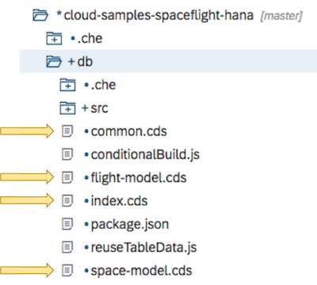

# Exercise 0: Prerequisite Steps


## 0.1 Log On To Your SAP Cloud Platform Account

The instructor will provide you with the following details in order to complete these exercises:

1. The userid and password for the SAP Cloud Platform account
1. The URL to start the correct instance of Full Stack Web IDE

### IMPORTANT

If you already have a trial account on the SAP Cloud Platform, then please ***do not*** use it!  You will run into memory allocation problems!

## 0.2 Configure Web IDE to Point to Cloud Foundry

1. Using the URL supplied by the instructor, start Web IDE

1. Select the preferences icon 
    1. From the "Workspace Preferences", select "Cloud Foundry"
    1. Select the name of your Cloud Foundry API endpoint from the drop-down list
    1. Select the Organization and Space names from the drop down lists
    1. Press the "Save" button at the bottom of the screen
    1. Please ***do not*** press the button saying "Reinstall Builder"!  
        Firstly, this action should not be necessary, and secondly, with multiple users sharing the same Cloud Foundry Space, thus action need only be performed once per Space, not once per user.

## 0.3 Clone the Git Repository

1. From the menu down the left side of the screen, select the Web IDE development view 

1. Right-click on the top level `Workspace` and select Git -> Clone Repository

1. Enter the Git repository name <https://github.com/SAP/cloud-sample-spaceflight-hana.git> and press Clone

1. You should now have a project in your Web IDE workspace called `cloud-sample-spaceflight-hana`

## 0.4 Compile and Deploy the Data Model

The data model used by this project is represented using a database-independent definition.  This representation must first be compiled into a form suitable for representation in a HANA database, and secondly, that representation must then be deployed to HANA in order for the tables to be both created a populated.

So we must perform two steps here:

1. Compile the database-independent `.cds` files into HANA specific `.hdbcds` files
1. Deploy the `.hdbcds` files to HANA.  This step can optionally populate the database tables as well

In the project's `db` folder, you will see various files with the suffix `.cds`.



These files contain a database-independent definition of the data model used in this project.

Currently, the CDS compiler only creates files suitable for HANA.  Compiling `.cds` files for other target databases is planned for the future.

### 0.4.1 Compile the `.cds` Files

1. Right click on the `cloud-sample-spaceflight-hana` project name and select Build -> Build CDS.  

    This invokes the CDS compiler to transform all the `.cds` files found in the `db` folder into HANA-specific `.hdbcds` files.  These generated files are then written to the folder `db/src/gen`.

    For more information on the behaviour of the CDS compiler, please read this [brief overview](./cdsCompile.md)
    
1. In the bottom right-hand corner of the Web IDE screen is a vertical menu.  

    Click on the console  icon to display the console output of the CDS build tool.  

    As the build tool runs, you will see output similar to the following:

    ```plain_text
    10:55:20 (DIBuild) Build of "/cloud-samples-spaceflight-hana" in progress.  
    10:55:21 (DIBuild) [INFO] Injecting source code into builder...  
    [INFO] Source code injection finished[INFO] ------------------------------------------------------------------------
    npm install
    
    10:55:23 (DIBuild) up to date in 0.871s
    npm run build
    
    > spaceflight-model@0.1.0 build /home/vcap/app/.java-buildpack/tomcat/temp/builder/sap.cds.mta/builds/build-6976017343015870064/cloud-samples-spaceflight-hana
    > cds build --clean
    
    This is CDS 2.7.0, Compiler 1.0.32, Home: node_modules/@sap/cds
    
    10:55:25 (DIBuild) Compiled 'db/index.cds' to
      db/src/gen/.hdinamespace
      db/src/gen/BOOKINGSERVICE_AIRCRAFTCODES.hdbcds
      db/src/gen/BOOKINGSERVICE_AIRLINES.hdbcds
      db/src/gen/BOOKINGSERVICE_AIRPORTS.hdbcds
      db/src/gen/BOOKINGSERVICE_BOOKINGS.hdbcds
      db/src/gen/BOOKINGSERVICE_EARTHROUTES.hdbcds
      db/src/gen/BOOKINGSERVICE_ITINERARIES.hdbcds
      db/src/gen/BOOKINGSERVICE_PLANETS.hdbcds
      db/src/gen/BOOKINGSERVICE_SPACELINES.hdbcds
      db/src/gen/BOOKINGSERVICE_SPACEPORTS.hdbcds
      db/src/gen/BOOKINGSERVICE_SPACEROUTES.hdbcds
      db/src/gen/TECHED_FLIGHT_TRIP_AIRCRAFTCODES.hdbcds
      db/src/gen/TECHED_FLIGHT_TRIP_AIRLINES.hdbcds
      db/src/gen/TECHED_FLIGHT_TRIP_AIRPORTS.hdbcds
      db/src/gen/TECHED_FLIGHT_TRIP_BOOKINGS.hdbcds
      db/src/gen/TECHED_FLIGHT_TRIP_EARTHROUTES.hdbcds
      db/src/gen/TECHED_FLIGHT_TRIP_ITINERARIES.hdbcds
      db/src/gen/TECHED_SPACE_TRIP_ASTRONOMICALBODIES.hdbcds
      db/src/gen/TECHED_SPACE_TRIP_SPACEFLIGHTCOMPANIES.hdbcds
      db/src/gen/TECHED_SPACE_TRIP_SPACEPORTS.hdbcds
      db/src/gen/TECHED_SPACE_TRIP_SPACEROUTES.hdbcds
      
    10:55:28 (DIBuild) Compiled 'srv/index.cds' to
      srv/src/main/resources/edmx/BookingService.xml
      srv/src/main/resources/edmx/csn.json
      
      CDS return code: 0
      10:55:28 (DIBuild) ********** End of /cloud-samples-spaceflight-hana Build Log **********
    ```

    Make a note of the table names `TECHED_FLIGHT_TRIP_AIRPORTS` and `TECHED_FLIGHT_TRIP_EARTHROUTES`.  We will need to reference these tables by their generated name and not the entity names used in the [`db/flight-model.cds`](../db/flight-model.cds) file.


### 0.4.2 Deploy The Compiled Data Model to HANA

1. Before starting the deploy process, it is worth first clearing console output.  To do this, Select View -> "Clear Console" from the Web IDE menu running across the top of the screen

1. In order to deploy the generated `.hdbcds` to HANA, right-click on the `db` folder and selecting Build -> Build

1. As this deployment process runs, you will see several hundred lines of output in the console that will end with something similar to the following:

    ```plain_text
      Finalizing...
        Checking the uniqueness of the catalog objects in the schema "CLOUD_SAMPLES_SPACEFLIGHT_HANA_SPACETRAVEL_HDI2_1"...
        Checking the uniqueness of the catalog objects in the schema "CLOUD_SAMPLES_SPACEFLIGHT_HANA_SPACETRAVEL_HDI2_1"... ok
      Finalizing... ok
      Make succeeded (0 warnings): 33 files deployed (effective 62), 0 files undeployed (effective 0), 0 dependent files redeployed
     Making... ok
     Starting make in the container "CLOUD_SAMPLES_SPACEFLIGHT_HANA_SPACETRAVEL_HDI2_1" with 33 files to deploy, 0 files to undeploy... ok
    Deploying to the container "CLOUD_SAMPLES_SPACEFLIGHT_HANA_SPACETRAVEL_HDI2_1"... ok (9s 316ms)
    No default-access-role handling needed; global role "CLOUD_SAMPLES_SPACEFLIGHT_HANA_SPACETRAVEL_HDI2_1::access_role" will not be adapted
    Unlocking the container "CLOUD_SAMPLES_SPACEFLIGHT_HANA_SPACETRAVEL_HDI2_1"...
    Unlocking the container "CLOUD_SAMPLES_SPACEFLIGHT_HANA_SPACETRAVEL_HDI2_1"... ok (0s 0ms)
    Deployment to container CLOUD_SAMPLES_SPACEFLIGHT_HANA_SPACETRAVEL_HDI2_1 done [Deployment ID: none].
    (11s 483ms)<br>
    13:41:43 (DIBuild) ********** End of /cloud-samples-spaceflight-hana/db Build Log **********
    13:41:44 (Builder) Build of /cloud-samples-spaceflight-hana/db completed successfully.
    ```

1. Scroll to the very top of the console and you will see output similar to the following:

    ```plain_text
    14:00:09 (Builder) Build of "/cloud-samples-spaceflight-hana/db" started.
    14:00:34 (DIBuild) Build of "/cloud-samples-spaceflight-hana/db" in progress.
    14:00:35 (DIBuild) Service provisioning for module: '/db'
    Created the 'cloud-samples-spaceflight-hana-spadFWrNEYzOc6XjntR' instance of the 'hana' service type for the 'spacetravel-hdi2' resource.
    [INFO] Injecting source code into builder...
    [INFO] Source code injection finished
    [INFO] ------------------------------------------------------------------------
    Your module contains a package.json file, it will be used for the build.
    14:00:38 (DIBuild)
    > deploy@ postinstall /home/vcap/app/.java-buildpack/tomcat/temp/builder/hdi-builder/builds/build-3277892664882001306/cloud-samples-spaceflight-hana/db
    > node conditionalBuild.js
    added 50 packages from 27 contributors in 1.306s
    14:00:41 (DIBuild) 
    > spaceflight-model@0.1.0 build /home/vcap/app/.java-buildpack/tomcat/temp/builder/hdi-builder/builds/build-3277892664882001306/cloud-samples-spaceflight-hana
    > cds build --clean
    This is CDS 2.7.0, Compiler 1.0.32, Home: node_modules/@sap/cds
    ```

    The important information is found on the fourth line that starts with `Created the 'cloud-samples-spaceflight-hana-xxxxxxxx' instance` where `xxxxxxxx` is some randomly generated identifier.  This is the name of your HDI Container within the HANA database.
    
    Make a note of your HDI Container name as you will need to know this when you later connect to the database using the Database Explorer tool in Web IDE.
    
    The reason for needing to know the HDI Container name is that during the TechEd training sessions, there will be multiple users all sharing the same Cloud Foundry Space.  A single HANA Database instance has been allocated to each Space, and within that Space (and therefore within that Space's HANA Database instance) each user will have their own HDI Container.
    
    When you perform the subsequent exercises, you will need to connect to your own HDI Container!
    
    
## 0.5 Summary

You have now used the Core Data Services (CDS) tools to do three things:

1. The "Build CDS" invokes the CDS compiler that compilesany `.cds` files found in the `db` folder into `.hdbcds` files suitable for building HANA database tables.  (The CDS compiler actually does much more than this, but here we are only interested in the compilation of  database table information)

   The result of this compilation process is the `.hdbcds` files found in the `db/src/gen/` folder

1. The second Build process then deploys the `.hdbcds` files to HANA.  This causes the tables both to be built in your own HDI Container, and also populated

1. Using the instructions found in the JSON file `db/src/csv/Data.hdbtabledata`, the deploy process also populates the HANA tables with data from the various `.csv` files found in the `db/src/csv` folder
   
# \</exercise>
