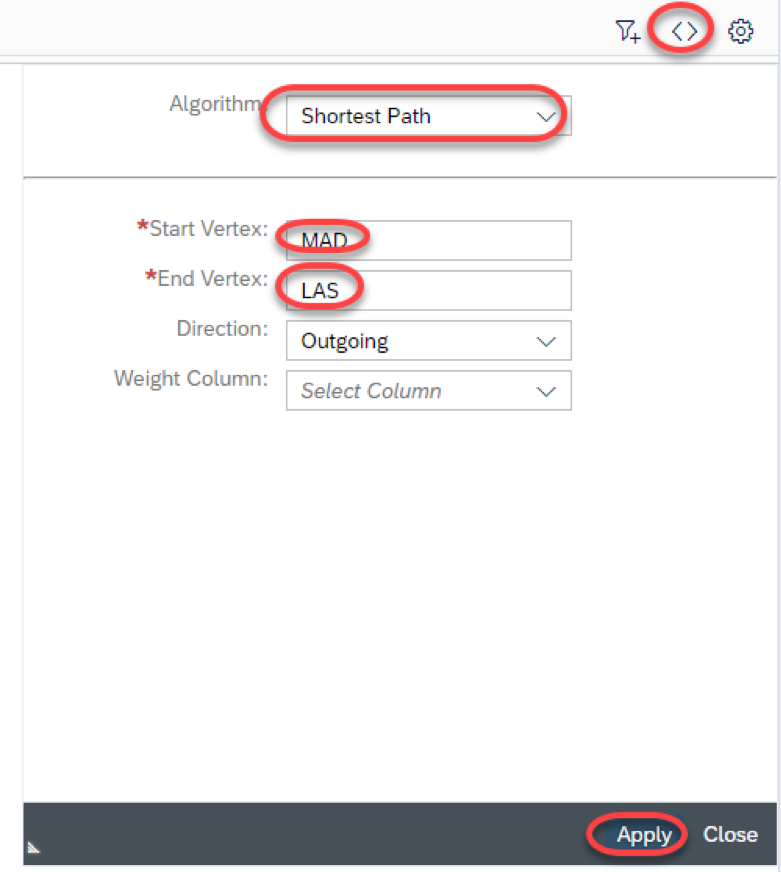

# Exercise 1: Create a HANA Graph

## Prerequisite Steps

1. It is assumed that you already have at least a trial account on SAP's Cloud Platform.  If this is not the case, please follow the instructions for creating an [SCP trial account](https://cloudplatform.sap.com/try.html)
1. You must clone the base spaceflight data model found in the Git repository <https://github.com/SAP/cloud-sample-spaceflight-hana.git> into your Web IDE workspace.
    1. Log on to your SCP account, open Web IDE and select the development view  
        
    1. Right-click on the top level `Workspace` and select Git -> Clone Repository
    1. Enter the link to the Git repo shown above and press Clone
    1. You now have a project in your Web IDE workspace called `cloud-sample-spaceflight-hana`
1. Right click on the `cloud-sample-spaceflight-hana` project name and select Build -. Build CDS
1. In the bottom right-hand corner of the Web IDE screen a column of three icons.  

    Click on the console  icon to display the console output of the CDS build tool.  

    You should output similar to the following:

    <pre>
    10:55:20 (DIBuild) Build of "/cloud-samples-spaceflight-hana" in progress.  
    10:55:21 (DIBuild) [INFO] Injecting source code into builder...  
    [INFO] Source code injection finished[INFO] ------------------------------------------------------------------------
    npm install
    
    10:55:23 (DIBuild) up to date in 0.871s
    npm run build
    
    > spaceflight-model@0.1.0 build /home/vcap/app/.java-buildpack/tomcat/temp/builder/sap.cds.mta/builds/build-6976017343015870064/cloud-samples-spaceflight-hana
    > cds build --clean
    
    This is CDS 2.7.0, Compiler 1.0.32, Home: node_modules/@sap/cds
    
    10:55:25 (DIBuild) Compiled 'db/index.cds' to
      db/src/gen/.hdinamespace
      db/src/gen/BOOKINGSERVICE_AIRCRAFTCODES.hdbcds
      db/src/gen/BOOKINGSERVICE_AIRLINES.hdbcds
      db/src/gen/BOOKINGSERVICE_AIRPORTS.hdbcds
      db/src/gen/BOOKINGSERVICE_BOOKINGS.hdbcds
      db/src/gen/BOOKINGSERVICE_EARTHROUTES.hdbcds
      db/src/gen/BOOKINGSERVICE_ITINERARIES.hdbcds
      db/src/gen/BOOKINGSERVICE_PLANETS.hdbcds
      db/src/gen/BOOKINGSERVICE_SPACELINES.hdbcds
      db/src/gen/BOOKINGSERVICE_SPACEPORTS.hdbcds
      db/src/gen/BOOKINGSERVICE_SPACEROUTES.hdbcds
      db/src/gen/TECHED_FLIGHT_TRIP_AIRCRAFTCODES.hdbcds
      db/src/gen/TECHED_FLIGHT_TRIP_AIRLINES.hdbcds
      db/src/gen/TECHED_FLIGHT_TRIP_AIRPORTS.hdbcds
      db/src/gen/TECHED_FLIGHT_TRIP_BOOKINGS.hdbcds
      db/src/gen/TECHED_FLIGHT_TRIP_EARTHROUTES.hdbcds
      db/src/gen/TECHED_FLIGHT_TRIP_ITINERARIES.hdbcds
      db/src/gen/TECHED_SPACE_TRIP_ASTRONOMICALBODIES.hdbcds
      db/src/gen/TECHED_SPACE_TRIP_SPACEFLIGHTCOMPANIES.hdbcds
      db/src/gen/TECHED_SPACE_TRIP_SPACEPORTS.hdbcds
      db/src/gen/TECHED_SPACE_TRIP_SPACEROUTES.hdbcds
      
    10:55:28 (DIBuild) Compiled 'srv/index.cds' to
      srv/src/main/resources/edmx/BookingService.xml
      srv/src/main/resources/edmx/csn.json
      
      CDS return code: 0
      10:55:28 (DIBuild) ********** End of /cloud-samples-spaceflight-hana Build Log **********
    </pre>

    Make a note of the highlighted table names: `TECHED_FLIGHT_TRIP_AIRPORTS` and `TECHED_FLIGHT_TRIP_EARTHROUTES` as we will need to reference these later.

# Exercise Steps

1. Right-click on the `db/src` folder and select New -> File  

    

1. Call the file `route.hdbgraphworkspace` and press Ok

    

1. This file is pre-populated with a template graph declaration that we will modify.  But first we need to know firstly which tables from our database will act as the vertex and edge tables of this graph, and secondly, the names of each table's key field.  

    ***Background***  
    A graph is built first by having a set of points, and second, by drawing lines between those points.  The technical name for a line is an edge, and the technical word for a point is a vertex; therefore, when we build a HANA graph, we must decide which table will supply the vertices, and which table will define the lines between those vertices.
    
    In our case, our list of airports will define the points (or vertices) of our graph, and the direct flights flown between two airports will define the lines (or edges) of our graph.
    
    So in order to define this graph, we need to answer the following questions:
    1. Which database tables can be used to supply the required edge and vertex information?
    1. What keys fields do these tables use?
    1. What association is there between the data in these two tables?

    ***IMPORTANT***  
    Only tables with a single key field may be selected for use in a HANA Graph!

1. Down the left side of Web IDE window is a column of icons.  Click on the Database Explorer icon  
    

1. Web IDE needs to connect to the HANA database instance that you built in the prerequisite steps, so in the pop-up window, click on Connect  
     

1. If you have never used this tool before, then the Database Explorer will now show you an empty list.  Click on the plus sign to connect to a database instance.
    

1. Select HDI Container and then select the `cloud-samples-spaceflight-xxxxxxxx` instance. If you have never built any HANA database instances before, then you will only see one name listed here. 

    

1. Once the Database Explorer has connected to your HANA instance, you will be able to select "Tables".

    

1. Click on the table `TECHED_FLIGHT_TRIP_EARTHROUTES` and you will now see this table's metadata displayed on the right.

    
    
    Here we can see that this table's key field is called `ID`
    
1. Now display the table `TECHED_FLIGHT_TRIP_AIRPORTS`.

    
    
    Here we can see that this table's key field is called `IATA3`

1. We now have enough information to declare our HANA Graph

    * The name of our graph is `ROUTES`
    * Each entry in table `TECHED_FLIGHT_TRIP_EARTHROUTES` represents a direct flight between two airports.  Therefore, this data can be used to draw the lines (or edges) of our graph.  
      This table has the key field `ID`
    * The points of our graph (or vertices) are defined in table `TECHED_FLIGHT_TRIP_AIRPORTS` that has the key field `IATA3`
    * The each direct flight listed in table `TECHED_FLIGHT_TRIP_EARTHROUTES` has a starting airport and a destination airport; therefore, the data in association `STARTINGAIRPORT_IATA3` defines where an edge starts, and the data in association `DESTINATIONAIRPORT_IATA3` defines where an edge stops.

    <pre>
    GRAPH WORKSPACE "ROUTES"
    
    EDGE TABLE "TECHED_FLIGHT_TRIP_EARTHROUTES"
      SOURCE COLUMN "STARTINGAIRPORT_IATA3"
      TARGET COLUMN "DESTINATIONAIRPORT_IATA3"
      KEY COLUMN "ID"
    
    VERTEX TABLE "TECHED_FLIGHT_TRIP_AIRPORTS"
      KEY COLUMN "IATA3"
    </pre>

1. Build the `.hdbgraphworkspace` file by right-clicking on the file name and selecting Build -> Build selected file

    

1. Go back to the database explorer by clicking on the icon down the left-hand side of the Web IDE screen 

1. Open the graph workspaces and select the `ROUTES` graph

    

1. Click on the glasses icon in the top right corner to display the `ROUTES` graph

    
    
    You can now see a graphical representation of all the direct flights listed in the `TECHED_FLIGHT_TRIP_EARTHROUTES` table.  In this case the graph is centred on Amsterdam-Schipol Airport in the Netherlands.
    
    

1. We can now use this graph to find the shortest route between two airports.  Select the "Shortest Path" algorithm and then select the location codes of your starting and destination airports.  In this case, we wish to travel from Madrid to Las Vegas.

    

    Hmmm, it thinks that we should fly via Panama.

    
    
    Something is clearly wrong here...

1. So no lets add the `DISTANCE` field as the weight parameter

    

   Ah, that's better.  Now we are being routed through Chicago's O'Hare International Airport
   
    
   
