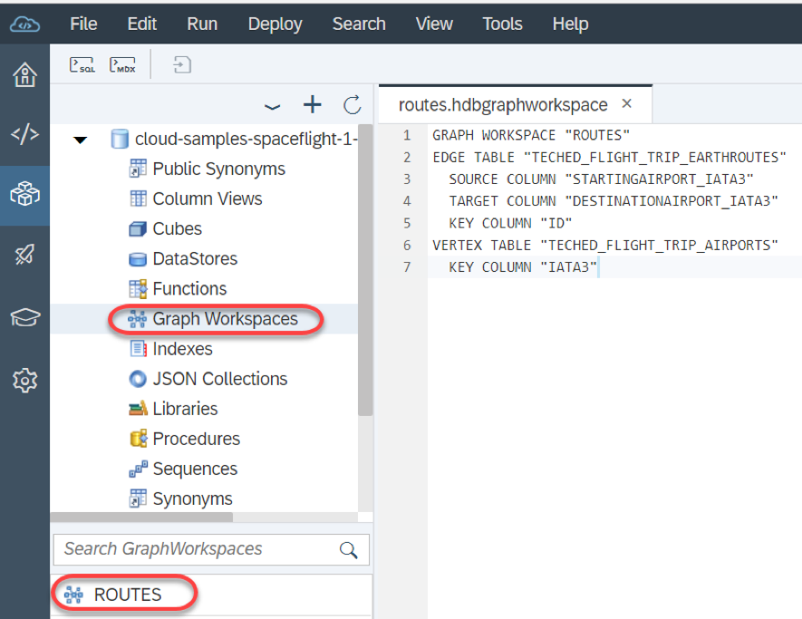

# Exercise 1: Create a HANA Graph

In this exercise, we will define a Graph and then deploy it to a HANA database; however, before we can do this, we need to understand what graphs are in general.

## What is a Graph?

### Description

A "graph" is the mathematical term for a data structure in which two or more objects are related to each other in some way.  Two types of information are needed to build a graph:
    
1. A set of points (known as "vertices")
1. A set of connections between these points (known as "edges")

In addition to simply joining vertices together with edges, these edges usually have some property that describes the strength (or "weight") of the connection.

The relationship between these objects is typically displayed graphically.  Something like this:

### So What Must I Know in Order to Build a Graph?
In order to build a graph, we must start by answering the following questions:

1. Which database table will supply the vertex information?
1. Which database table will supply the edge information?

In order for a graph to be built, the data in your vertex and edge tables must have a defined association

### Turning Airport and Route Information into a Graph

In our case, our graph is going to visualise all the direct flights that can be taken between airports. Therefore, we know that:

* The vertex information will be obtained from the database table generated from the `Airports` entity
* The edge information will be obtained from the database table generated from the `Earthroutes` entity  

***IMPORTANT***  
Notice here that the `Airports` and `Earthroutes` entities defined in the CDS Data Model are not the data sources for our vertex and edge information.  Instead, the data sources are the database tables generated as a result of compiling and deploying the CDS Data Model to HANA.

This is an important distinction because we need to understand how the CDS compiler transforms an entity name in a `.cds` file into a database table name (defined in a `.hdbcds` file).

In order to define the HANA graph, we need to know the following relationship:

| CDS Entity | | Generated Table Name |
|---|---|---|
| `Airports` | becomes | `TECHED_FLIGHT_TRIP_AIRPORTS` |
| `Earthroutes` | becomes | `TECHED_FLIGHT_TRIP_EARTHROUTES` |

This is why, in [prerequisite step 3.1](./ex0.3.md#3.1), you were asked to make a note of the above two generated table names.

***IMPORTANT***  
Only tables with a single key field may be selected for use in a HANA Graph!

## Exercise Steps

1. Right-click on the `db/src` folder and select New -> File  

    

1. Call the file `routes.hdbgraphworkspace` and press Ok

    

1. This file is pre-populated with a template graph declaration that we will modify; however, before we can modify this file, we need to know which fields from which tables will be used

1. At this point, it is assumed you have successfully completed [prerequisite step 3](./ex0.3.md) in which you compiled and deployed your CDS Data Model to HANA.  If this step has not been completed, please complete it now!

1. Right-click on the `db` folder and select "Open HDI Container".

    
    
    ***Warning***  
    After selecting "Open HDI Container", it is possible that you might see the following error message:
    
    
    
    This is not correct!  If you see this error message, close the pop-up and then press the refresh button in the top right of the Database Explorer pane:
    
    

1. The Database Explorer is now connected to your HDI container.  Expand the container name and select "Tables".

    

1. Click on the table `TECHED_FLIGHT_TRIP_EARTHROUTES` and you will now see this table's metadata displayed on the right.

    
    
    Here we can see that this table's key field is called `ID`.  There are also two other fields that contain the IATA location codes of the starting and destination airports.
    
1. Now display the table `TECHED_FLIGHT_TRIP_AIRPORTS`.

    
    
    Here we can see that this table's key field is called `IATA3`

1. We now have enough information to declare our HANA Graph

    * The name of our graph is `ROUTES`
    * The edges of our graph correspond to the entries in table `TECHED_FLIGHT_TRIP_EARTHROUTES`
    * The vertices of our graph correspond to the entries in table `TECHED_FLIGHT_TRIP_AIRPORTS`
    * Table `TECHED_FLIGHT_TRIP_EARTHROUTES` has a key field called `ID` and table `TECHED_FLIGHT_TRIP_AIRPORTS` has a key field called `IATA3`
    * The each direct flight listed in table `TECHED_FLIGHT_TRIP_EARTHROUTES` has a starting airport and a destination airport; therefore, the data in association `STARTINGAIRPORT_IATA3` defines where an edge starts, and the data in association `DESTINATIONAIRPORT_IATA3` defines where an edge stops
    * The `DISTANCE` field in table `TECHED_FLIGHT_TRIP_EARTHROUTES` can be used to define the weight of the connection between two vertices

    <pre>
    GRAPH WORKSPACE "ROUTES"
    
    EDGE TABLE "TECHED_FLIGHT_TRIP_EARTHROUTES"
      SOURCE COLUMN "STARTINGAIRPORT_IATA3"
      TARGET COLUMN "DESTINATIONAIRPORT_IATA3"
      KEY COLUMN "ID"
    
    VERTEX TABLE "TECHED_FLIGHT_TRIP_AIRPORTS"
      KEY COLUMN "IATA3"
    </pre>

1. Build the `.hdbgraphworkspace` file by right-clicking on the file name and selecting Build -> Build selected file

    

1. Go back to the database explorer by clicking on the icon down the left-hand side of the Web IDE screen 

1. Open the graph workspaces and select the `ROUTES` graph

    

1. Click on the glasses icon in the top right corner to display the `ROUTES` graph

    
    
    You can now see a graphical representation of all the direct flights listed in the `TECHED_FLIGHT_TRIP_EARTHROUTES` table.  In this case the graph is centred on the airport with the IATA location code `AMS` (Amsterdam-Schipol Airport in the Netherlands).
    
    

# \</exercise>
