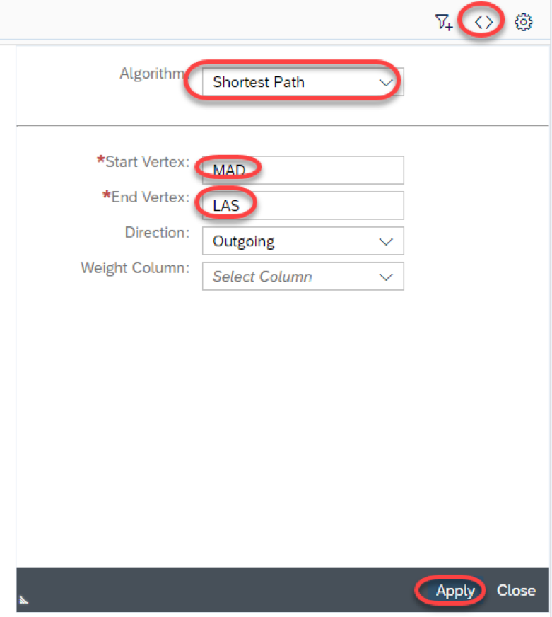
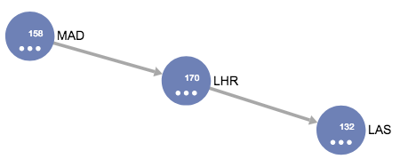
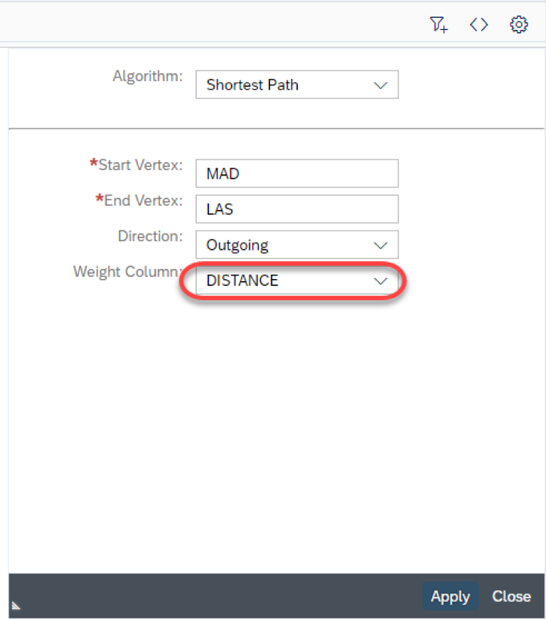
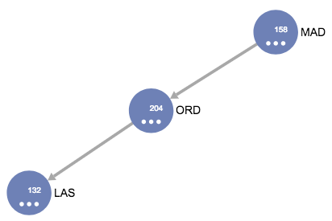

# Exercise 2: HANA Graph Showing the Shortest Path

Starting from the HANA graph, we can now find the shortest journey between two airports for which we know there are no direct flights. For instance, we happen to know that in our `EarthRoutes` entity, there is no direct flight from Madrid to Las Vegas.

So lets use the HANA Graph to calculate firstly ***a*** route, and secondly, the ***shortest*** route.

1. Click on the "Algorithm" icon `<>` in the top left corner then from the drop-down menu, select "Shortest Path".

1. Now select the location codes of your starting and destination airports. In this case, we wish to travel from Madrid (`MAD`) to Las Vegas (`LAS`).

    ***IMPORTANT***  
    The values you enter in the Start and End Vertex fields are case-sensitive!

    

1.  After pressing Apply, the HANA graph proposes that we fly from Madrid to Las Vegas via London Heathrow (`LHR`).

    
    
1. This is certainly a popular route, but it does not cover the shortest distance.  So now let's add the `DISTANCE` field as the weight column and press Apply again

    

1. Now the HANA graph has found the shortest distance.  In this case we are being routed through Chicago's O'Hare International Airport (this journey is approximately 500Km shorter than flying via London)

    

# \</exercise>
