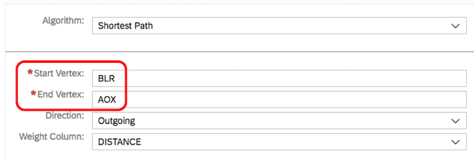
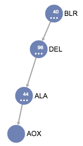

# Exercise 2: HANA Graph Showing the Shortest Path

Starting from the HANA graph, we can now find the shortest journey between two airports for which we know there are no direct flights. For instance, we happen to know that in our `EarthRoutes` entity, there is no direct flight from Madrid to Las Vegas.

So lets use the HANA Graph to calculate firstly ***a*** route, and secondly, the ***shortest*** route.

1. Click on the "Algorithm" icon `<>` in the top left corner then from the drop-down menu, select "Shortest Path".

1. Now enter the location codes of your starting and destination airports.  
    In this case, we wish to travel from Madrid (`MAD`) to Las Vegas (`LAS`).

    ***IMPORTANT***  
    The values you enter in the Start and End Vertex fields are case-sensitive!

    

1.  After pressing Apply, the HANA graph proposes that we fly from Madrid to Las Vegas via London Heathrow (`LHR`).

    
    
    You might be wondering why the HANA graph proposed this route.
    
    The HANA graph found all the paths with the least number of edges between the `MAD` vertex and the `LAS` vertex, then in the absence of any other information, simply presented us with the first of these paths.
    
    Hence `MAD` -> `LHR` -> `LAS`.
    
1. This is certainly a popular route, but its not what we're looking.

    If we now want to find the path with the shortest geographical distance, we must additionally tell the HANA graph which field to examine in order to discover the path with the lowest weight.

    So now let's add the `DISTANCE` field as the weight column and press Apply again

    

1. Now the HANA graph has found the path with the lowest weight - or in less academic language, the route with the shortest geographical distance.  In this case we are being routed through Chicago's O'Hare International Airport which shortens the journey by approximately 500Km

    

1. In keeping with our theme of Space Travel, let's say we live in Bangalore, India and we want to fly to the Moon.  Our journey is broken up into two major sections: the first part where we travel from our home city to the spaceport, and the second part where we travel from the spaceport to the destination planet.

    In the case of Bangalore, the nearest spaceport is the Russian Spaceflight Centre in Baikonur, Kazahkstan.  So let's discover the shortest route from Bangalore to Baikonur.

    In this case, you just have to know that the airport at Baikonur is not called "Baikonur", but "Yubileyniy" and it has an IATA location code of `AOX`... 

    
    
    Change the start and end vertices to `BLR` and `AOX` respectively and press Apply again.
    
    
    
    Here, we can cess that our journey will take us from:
    
    * `BLR` (Bangalore) to
    * `DEL` (Delhi) to
    * `ALA` (Almaty), then finally to
    * `AOX` (Yubileyniy)

[Previous Exercise](./ex1_create_hana_graph.md)&nbsp;&nbsp;&nbsp;&nbsp;&nbsp;&nbsp;&nbsp;&nbsp;&nbsp;&nbsp;&nbsp;&nbsp;&nbsp;&nbsp;&nbsp;&nbsp;&nbsp;&nbsp;&nbsp;&nbsp;&nbsp;&nbsp;&nbsp;&nbsp;&nbsp;&nbsp;&nbsp;&nbsp;&nbsp;&nbsp;&nbsp;&nbsp;&nbsp;&nbsp;&nbsp;&nbsp;&nbsp;&nbsp;&nbsp;&nbsp;&nbsp;&nbsp;&nbsp;&nbsp;&nbsp;&nbsp;&nbsp;&nbsp;&nbsp;&nbsp;&nbsp;&nbsp;&nbsp;&nbsp;&nbsp;&nbsp;&nbsp;&nbsp;&nbsp;&nbsp;&nbsp;&nbsp;&nbsp;&nbsp;&nbsp;&nbsp;&nbsp;&nbsp;&nbsp;&nbsp;&nbsp;&nbsp;&nbsp;&nbsp;&nbsp;&nbsp;&nbsp;&nbsp;&nbsp;&nbsp;&nbsp;&nbsp;&nbsp;&nbsp;&nbsp;&nbsp;&nbsp;&nbsp;&nbsp;&nbsp;&nbsp;&nbsp;&nbsp;&nbsp;&nbsp;&nbsp;&nbsp;&nbsp;&nbsp;&nbsp;&nbsp;&nbsp;&nbsp;&nbsp;&nbsp;&nbsp;&nbsp;&nbsp;&nbsp;&nbsp;&nbsp;&nbsp;&nbsp;&nbsp;&nbsp;&nbsp;&nbsp;&nbsp;&nbsp;&nbsp;&nbsp;[Next Exercise](./ex3_no_stops_calc_view.md)

# \</exercise>
