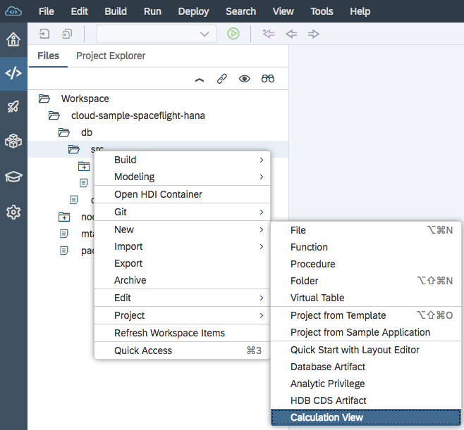
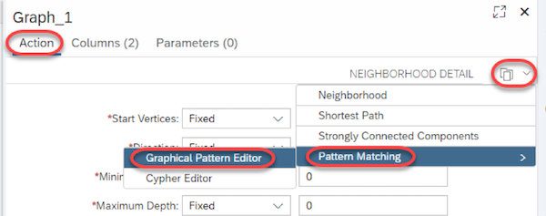
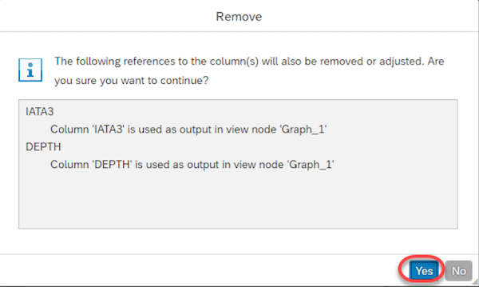

# Exercise 4: Calculation View Showing Routes Requiring One Stop

## Before you Start...

Before starting this exercise, you must first have:

1. Compiled and deployed your Spaceflight data model to HANA.  See pre-requisite exercises [0.4](https://github.com/SAP/cloud-sample-spaceflight-hana/blob/master/docs/ex0.4.md) and [0.5](https://github.com/SAP/cloud-sample-spaceflight-hana/blob/master/docs/ex0.5.md) for details.
1. Completed [exercise 1](./ex1_create_hana_graph.md) in which you create a HANA Graph.  We will consume this graph during this exercise.

## Exercise Steps

1. Create a new Calculation View

    
    
    Call this new Calculation View `route1stop` and make sure that the Data Category is `DEFAULT`.
    
1. Add a new Graph

    

1. Add the graph we created in [exercise 1](./ex1_create_hana_graph.md) as the data source

    

1. Select the details pane by clicking on the "Expand Details" icon  then add two new parameters

    

1. For each item in the table below, repeat the following steps:

    | Name | Is Mandatory | Data Type | Length |
    |---|:-:|---|:-:|
    | `airportFrom` |  | `NVARCHAR` | 3
    | `airportTo` |  | `NVARCHAR` | 3

    
    
    
    

1. Now add an action.  From the drop-down menu on the right select "Pattern Matching" -> "Graphical Pattern Editor"

    

    You will be asked to confirm the adjustment of the following fields

    

1. If you remember from the first exercise, a graph as a visual representation of the connections (or edges) that exist between a set of points (or vertices).  Since we are planning air travel involving one stop, the vertices of our graph will be airports and the edges will be direct flights taken between these airports.

    Add the following three vertices, `Start`, `ChangeAt` and `Destination`

    Click on the `+` icon and drop a vertex on the left side of the editor area.

    

    Each vertex you add will be automatically named `V1`, `V2` or `V3` etc.  You will need to rename these vertices by clicking on the name and entering the new value.
    
    After you've added and renamed three vertices, your editor will now look like this:

    


1. The `Start` and `Destination` vertices must now have input parameters assigned to the following table fields:

    | Vertex Name | Attribute | Value |
    |---|:-:|---|
    | `Start` | `IATA3` | Input Parameter `airportFrom` 
    | `Destination` | `IATA3` | Input Parameter `airportTo` 

    For the `Start` and `Destination` vertices, click on the link in the Attribute column
    
    

    Select attribute `IATA3` and change the Value to "Input Parameter" and either `airportFrom` or `airportTo` as per the table above

    

1. Now create the graph edges by dragging the arrow from the `Start` vertex to the `ChangeAt` vertex.

    
    
    Repeat this process and connect the `ChangeAt` vertex to the `Destination` vertex
    
    These edges will automatically be named `E1`, `E2` etc.; however, for the sake of clarity, we will rename these edges `Leg1` and `Leg2` respectively.
    
    Your graph should now look like this:

    
    
1. Now select Mapping from the Graph Detail Pane

    
    
    For each Data Source field shown in the table below, drag that field onto the Output Column area on the right

    | Data Source Type | Data Source Name| Field Name |
    |---|---|---|
    | Vertex | `Start` | `IATA3`
    | Vertex | `ChangeAt` | `IATA3`
    | Vertex | `Destination` | `IATA3`
    | Edge | `Leg1` | `ID`
    | Edge | `Leg1` | `DISTANCE`
    | Edge | `Leg1` | `AIRLINE_IATA2`
    | Edge | `Leg2` | `ID`
    | Edge | `Leg2` | `DISTANCE`
    | Edge | `Leg2` | `AIRLINE_IATA2`

    After this mapping is complete, if you collapse the individual data sources on the left of the Mapping screen, your mapping will look like this:
    
    


1. Insert a new projection in between `Projection` and `Graph_1` then connect `Graph_1` to this new projection

    

    


1. Map all the fields in the graph to the output of the projection.

    

    The projection mapping should now look like this:
    
    


1. In `Projection_1`, we now need to create three calculated columns.

    The purpose of these columns is to take the values from individual fields and merge them together in some way to form a more user-friendly value.  For instance, it would be helpful to have fields that display things like:
    
    1. A text string describing all the legs of the journey
    1. A text string showing which airline companies will be used on this journey
    1. The total journey distance
    
    
1. Add a new calculated column
    
    

    Select the newly created column

    
    
    Call this column `routeText`, change its type to be `NVARCHAR` and give it a length of `50`.
    
    
    
    The purpose of this calculated column is to concatenate the airport location codes together.
    
    For example, we know that there is no direct flight from Madrid, Spain (`MAD`) to Las Vegas (`LAS`); therefore, we would need to change at somewhere like Chicago's O'Hare International Airport (`ORD`).  Therefore, we want such a route to be displayed as:
    
    `MAD -> ORD -> LAS`
    
    Since the SQL function `CONCAT` only takes two parameters, we need to use nested `CONCAT` calls to achieve the required result.  Now add the following expression:
    
    ```
    CONCAT(
      CONCAT(
        CONCAT(
          CONCAT(
            "IATA3"
          , ' -> '
          )
        , "IATA3_1"
        )
      , ' -> '
      )
    , "IATA3_2"
    )
    ```
    
    Press "Validate Syntax" to make sure there are no typos.
        
    

1. Repeat the above steps for another calculated column called `airlineText`

    | Property | Value |
    |---|---|
    | Name | `airlineText`
    | Type | `NVARCHAR`
    | Length | 40
    
    The expression value creates a comma separated list of airline codes:
    
    ```
    CONCAT(
      CONCAT(
        "AIRLINE_IATA2"
      , ', '
      )
    , "AIRLINE_IATA2_1"
    )
    ```

1. Repeat the above steps for another calculated column called `totalDistance`

    | Property | Value |
    |---|---|
    | Name | `totalDistance`
    | Type | `INTEGER`
    
    The expression value simply adds up the distances of the two legs of the journey:
    
    ```
    "DISTANCE" + "DISTANCE_1"
    ```

1. Now connect `Projection_1` to the main Projection

    

1. Select the main Projection and, following the order shown below, map the following fields from `Projection_1` through to the Output columns.

    Some of the output columns will need to be renamed.
    
    | Data Source | Output Column | Renamed to |
    |---|---|---|
    | `IATA3` | `IATA3` | `startingAirport` 
    | `IATA3_2` | `IATA3_2` | `destinationAirport` 
    | `routeText` | `routeText` | 
    | `airlineText` | `airlineText` | 
    | `totalDistance` | `totalDistance` | 
    | `ID` | `ID` | `leg1` 
    | `ID_1` | `ID_1` | `leg2` 
    
    Once complete, your mapping will look like this:

    

1. Now we are ready to build the calculation view

    

1. After the view has built successfully, select Data Preview

    

1. Enter two airports between which we know no direct flight exists.  For instance from Madrid (`MAD`) to Las Vegas (`LAS`), then press "Open Content" in the toolbar above.

    

1. In the case of flying from Madrid to Las Vegas, you will see that 243 possible routes have been found.

    

1. Sort the Distance column into ascending order, and you will see that the shortest route from Madrid to Las Vegas is to fly via Chicago's O'Hare International airport (`ORD`)

    

1. Multiple occurrences of the same route are shown because each leg of the journey is operated by a different combination of the airline companies.

    


[Previous Exercise](./ex3_no_stops_calc_view.md)&nbsp;&nbsp;&nbsp;&nbsp;&nbsp;&nbsp;&nbsp;&nbsp;&nbsp;&nbsp;&nbsp;&nbsp;&nbsp;&nbsp;&nbsp;&nbsp;&nbsp;&nbsp;&nbsp;&nbsp;&nbsp;&nbsp;&nbsp;&nbsp;&nbsp;&nbsp;&nbsp;&nbsp;&nbsp;&nbsp;&nbsp;&nbsp;&nbsp;&nbsp;&nbsp;&nbsp;&nbsp;&nbsp;&nbsp;&nbsp;&nbsp;&nbsp;&nbsp;&nbsp;&nbsp;&nbsp;&nbsp;&nbsp;&nbsp;&nbsp;&nbsp;&nbsp;&nbsp;&nbsp;&nbsp;&nbsp;&nbsp;&nbsp;&nbsp;&nbsp;&nbsp;&nbsp;&nbsp;&nbsp;&nbsp;&nbsp;&nbsp;&nbsp;&nbsp;&nbsp;&nbsp;&nbsp;&nbsp;&nbsp;&nbsp;&nbsp;&nbsp;&nbsp;&nbsp;&nbsp;&nbsp;&nbsp;&nbsp;&nbsp;&nbsp;&nbsp;&nbsp;&nbsp;&nbsp;&nbsp;&nbsp;&nbsp;&nbsp;&nbsp;&nbsp;&nbsp;&nbsp;&nbsp;&nbsp;&nbsp;&nbsp;&nbsp;&nbsp;&nbsp;&nbsp;&nbsp;&nbsp;&nbsp;&nbsp;&nbsp;&nbsp;&nbsp;&nbsp;&nbsp;&nbsp;&nbsp;&nbsp;&nbsp;&nbsp;&nbsp;&nbsp;[Next Exercise](./ex5_calc_view_as_odata_srv.md)


# \</exercise>
