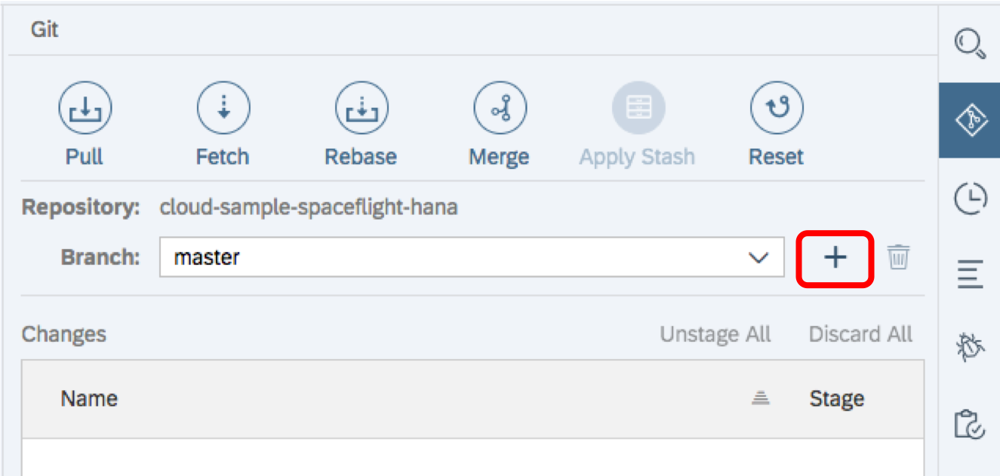
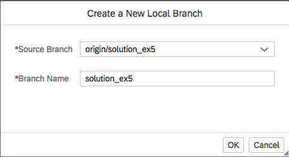
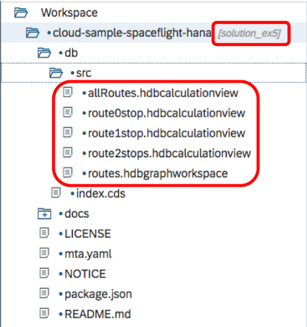

# Exercise 5: Create an OData Service from a Calculation View


In this last exercise, we will expose a calculation view called `AllRoutes` as an OData service.

You do not have to create this calculation view, as that step has already been done for you.

## Exercise Steps

1. From the vertical toolbar down the right side of the Web IDE screen, click on the Git icon  to expand the Git pane.
    
    
1. Create a new local branch by clicking on the `+` icon

    

1. From the "Source Branch" drop down list, select `origin/solution_ex5`

    
    
    The branch name will default to the name of teh source branch, so press OK

1. Your workspace will now look like this.  Notice that the Git branch name is now *`[solution_ex5]`* and that the `db` folder now contains two additional calculation views `route2stops.hdbcalculationview` and `allRoutes.hdbcalculationview`

    

1. Right-click on the project name and select New -> NodeJS Module
    
    
    
1. Call the module `all_routes` and press Next

1. You can give the module a description if you wish, but the important option here is to switch on the "Enable XSJS Support" flag.

    

    Press "Finish"

1. Open the file `server.js` and change the value of the `redirectUrl` property on line 10 to the following:

    ```javascript
    "/xsodata/AllRoutes.xsodata?$format=json"
    ```

    The entire `options` object should now look like this:
    
    ```javascript
    var options = {
        anonymous : true, // remove to authenticate calls
        redirectUrl : "/xsodata/AllRoutes.xsodata?$format=json"
    };
    ```

    On line 15, change the name of the `hana.tag` property from `hana` to `spacetravel-hdi`
    
    ```javascript
    options = Object.assign(options, xsenv.getServices({ hana: {tag: "spacetravel-hdi"} }));
    ```

    Notice here that we have told the `xsjs` server to redirect incoming requests to an `.xsodata` file called `AllRoutes`.  We now need to create this file.

1. Right-click on the `all_routes/lib` folder and create a new folder called `xsodata`

1. Right-click on the new `all_routes/lib/xsodata` folder and create a new file called `AllRoutes.xsodata`

    

1. This file will now contain the Core Data Services (CDS) definition of our OData service.

    ```
    service {
      "allRoutes" as "AllRoutes"
      keys generate local "IDS"
      parameters via entity;
    }
    ```

    This declaration instructs CDS to do several things:
    
    1. Take the underlying calculation view called `allRoutes` and expose it as an OData service called `AllRoutes`
    1. An OData collection requires at least one key field; however, we are exposing a calculation view that has no defined key fields of any sort.  Therefore, in order to satisfy the OData's requirement for a key field, we are instructing CDS to generate a temporary key field called `IDS`.  This field is always of type `Edm.String` and will number the entries starting from `"1"`.
    1. The `allRoutes` calculation view uses two parameters: `airportFrom` and `airportTo`.  These parameters need be exposed directly from the underlying entity in order to allow user selection.

1. 

# \</exercise>
