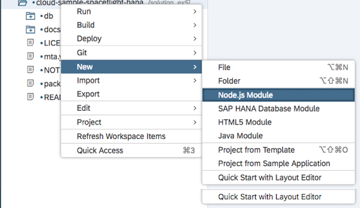
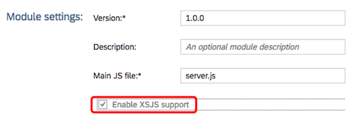
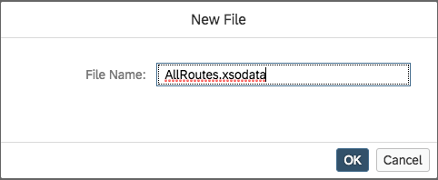
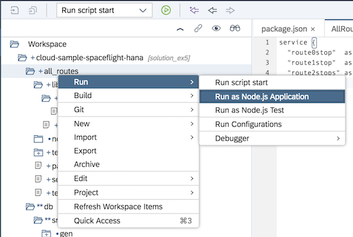
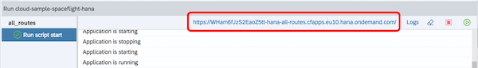

# Exercise 5: Expose Calculation Views as an OData Service


In this last exercise, we will expose all our calculation views as individual entity sets of an OData service.


## Exercise Steps

For each of the three calculation views (`route0stop`, `route1stop` and `route2stops`), repeat the following steps:

1. Right-click on the project name and select New -> NodeJS Module
    
    
    
1. Call the module `all_routes` and press Next

1. You can give the module a description if you wish, but the important option here is to switch on the "Enable XSJS Support" flag.

    

    Press "Finish"

1. Open the file `server.js` and change the value of the `redirectUrl` property on line 10 to the following:

    ```javascript
    "/xsodata/AllRoutes.xsodata?$format=json"
    ```

    The entire `options` object should now look like this:
    
    ```javascript
    var options = {
        anonymous : true, // remove to authenticate calls
        redirectUrl : "/xsodata/AllRoutes.xsodata?$format=json"
    };
    ```

    Notice here that we have told the `xsjs` server to redirect incoming requests to an `.xsodata` file called `AllRoutes`.

    We now need to create this file.

1. Right-click on the `all_routes/lib` folder and create a new folder called `xsodata`

1. Right-click on the new `all_routes/lib/xsodata` folder and create a new file called `AllRoutes.xsodata`

    

1. The objective here is to expose each calculation view as a separate entity set within an OData service.  Enter the following CDS definition into the file `AllRoutes.xsodata`:

    ```
    service {
      "route0stop"  as "DirectFlights" keys("ID") parameters via entity;
      "route1stop"  as "OneStop"       keys("ID") parameters via entity;
      "route2stops" as "TwoStops"      keys("ID") parameters via entity;
    }
    ```

    This declaration does the following:
    
    1. The OData service name is derived from the filename.  In this case `AllRoutes`.

    1. Each calculation view is exposed as an entity set within this service using this syntax:

        `<calculation view name> as <entity set name>`
        
    1. The `keys("ID")` part is needed because all OData entities require a key field (even if that key serves no purpose).  This statement causes a dummy key field called `ID` to be generated

    1. `parameters via entity` causes the input parameters for each calculation view (`airportFrom` and `airportTo`) to be made visible through a corresponding entity set ending with the word `Parameters`

1. Right-click on the `all_routes` NodeJS app name and select Run -> Run as NodeJS Application

    

   When you select this option for the first time, it will take some time to work because an `npm install` is being run behind the scenes to generate a new NodeJS application.  This app is then deployed to the SAP Cloud Platform.  Running this option a second time is always much quicker (unless you change something like the `package.json` file)
   
1. Once the build and deploy has finished. at the bottom of the SAP Web IDE screen, you will see a message saying "Application is running" and above, you will see the URL to the running app.

    

1. Click on this URL and you will see running app in a new browser tab

1. Due to the fact that in `server.js` we redirected the request to `/xsodata/AllRoutes.xsodata?$format=json`, we immediately see following output:

    ```
    {
      "d": {
        "EntitySets": [
          "DirectFlights",
          "OneStop",
          "TwoStops",
          "DirectFlightsParameters",
          "OneStopParameters",
          "TwoStopsParameters"
        ]
      }
    }
    ```

    Notice that each of our entity sets has a corresponding `Parameters` entity set.  So in order to read some data from a calculation view, we must do so using a `Parameters` entity set.

1.  Here we will search for direct flights form London Heathrow to New York John F. Kennedy.  To invoke this search, change the URL to the following:

    `xsodata/AllRoutes.xsodata/DirectFlightsParameters(airportFrom='LHR',airportTo='JFK')/Results`

    The general pattern of the URL is shown in this table
    
    | URL Segment | Meaning |
    |---|---|
    | `xsodata/AllRoutes.xsodata` | The OData service name |
    | `DirectFlightsParameters` | The entity set name |
    | `(airportFrom='LHR',airportTo='JFK')` | The search predicate |
    | `/Results` | The entity set name containing the search results |

1. Invoking the above search will generate search results similar to the following

    ```
    {
      "d": {
        "results": [
          {
            "__metadata": {
              "uri": "https://wham6fjzs2eaoz5tt-hana-all-routes.cfapps.eu10.hana.ondemand.com/xsodata/AllRoutes.xsodata/DirectFlights('LHRJFKAA')",
              "type": "default.DirectFlightsType"
            },
            "ID": "LHRJFKAA",
            "DISTANCE": 5541,
            "STARTINGAIRPORT_IATA3": "LHR",
            "DESTINATIONAIRPORT_IATA3": "JFK",
            "AIRLINE_IATA2": "AA",
            "EQUIPMENT_AIRCRAFT1_EQUIPMENTCODE": "77W",
            "EQUIPMENT_AIRCRAFT2_EQUIPMENTCODE": "777",
            "EQUIPMENT_AIRCRAFT3_EQUIPMENTCODE": null,
            "EQUIPMENT_AIRCRAFT4_EQUIPMENTCODE": null,
            "EQUIPMENT_AIRCRAFT5_EQUIPMENTCODE": null,
            "EQUIPMENT_AIRCRAFT6_EQUIPMENTCODE": null,
            "EQUIPMENT_AIRCRAFT7_EQUIPMENTCODE": null,
            "EQUIPMENT_AIRCRAFT8_EQUIPMENTCODE": null,
            "EQUIPMENT_AIRCRAFT9_EQUIPMENTCODE": null,
            "routeText": "LHR->JFK"
          },
          {
            "__metadata": {
              "uri": "https://wham6fjzs2eaoz5tt-hana-all-routes.cfapps.eu10.hana.ondemand.com/xsodata/ AllRoutes.xsodata/DirectFlights('LHRJFKAF')",
              "type": "default.DirectFlightsType"
            },
            "ID": "LHRJFKAF",
            "DISTANCE": 5541,
            "STARTINGAIRPORT_IATA3": "LHR",
            "DESTINATIONAIRPORT_IATA3": "JFK",
            "AIRLINE_IATA2": "AF",
            "EQUIPMENT_AIRCRAFT1_EQUIPMENTCODE": "76W",
            "EQUIPMENT_AIRCRAFT2_EQUIPMENTCODE": "764",
            "EQUIPMENT_AIRCRAFT3_EQUIPMENTCODE": null,
            "EQUIPMENT_AIRCRAFT4_EQUIPMENTCODE": null,
            "EQUIPMENT_AIRCRAFT5_EQUIPMENTCODE": null,
            "EQUIPMENT_AIRCRAFT6_EQUIPMENTCODE": null,
            "EQUIPMENT_AIRCRAFT7_EQUIPMENTCODE": null,
            "EQUIPMENT_AIRCRAFT8_EQUIPMENTCODE": null,
            "EQUIPMENT_AIRCRAFT9_EQUIPMENTCODE": null,
            "routeText": "LHR->JFK"
          }
        <snip>
        ]
      }
    }
    ```


[Previous Exercise](./ex4_)

# \</exercise>
